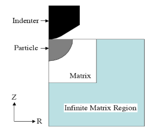
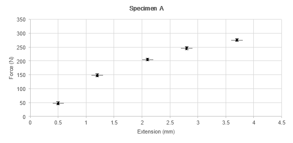



**GENG4412/5512 Engineering Research Project**

**Final Report Preparation Guide** 

**Semester 2, 2025**

**Associate Professor Jeremy Leggoe**

School of Engineering, University of Western Australia

**Associate Professor Dianne Hesterman**

School of Engineering, University of Western Australia

**© Aug 2025**

# **DECLARATION OF CONTRIBUTION**

You must provide the required information below and sign this declaration page. When you submit your report, you are confirming that the information provided is correct.  See Section 2.3 of this guide for more information.

**My contribution**

Provide details here of your contribution to the project and the contribution of others.

**Use of AI tools**

I have used AI tools in the preparation of my report: Yes/No

Details of how AI tools were used: 

In accordance with University Policy, I certify that:

*The above information is correct, and the attached work submitted for assessment is my own work and that all material drawn from other sources has been fully acknowledged and referenced.*

Student signature   \_\_\_\_\_\_\_\_\_\_\_\_\_\_\_\_\_\_\_\_\_\_\_\_\_\_\_\_\_\_\_\_		Date   \_\_\_\_\_\_\_\_\_\_\_\_\_\_\_\_

**Supervisor confirmation**

To the best of my knowledge, the student’s contribution outlined above is correct.

Supervisor signature   \_\_\_\_\_\_\_\_\_\_\_\_\_\_\_\_\_\_\_\_\_\_\_\_\_\_\_\_\_\_		Date   \_\_\_\_\_\_\_\_\_\_\_\_\_\_\_\_

**Project Summary** 

The Project Summary (also known as the synopsis, or abstract) should provide a clear, concise executive summary of the project. It should briefly identify the reasons for undertaking the project, the objectives of the project, the approach(es) used to achieve the objectives, a summary of the key findings or recommendations, and suggestions for future work. It should not exceed one page. It should be placed on a page of its own, immediately following your signed declaration.  Further detail about the project is provided in the main body of the report.

**List of Publications**

If the project has generated manuscripts that have been accepted or submitted to journals or conferences for publication, then a list of these publications should be provided. Only those manuscripts that have already been submitted to a conference or journal should be listed. You do not list any papers that are in the ‘preparation’ phase.  Be sure to state whether a paper has been submitted or has been published.  

For example,

Submitted for publication:

Student, J. Q., Supervisor, J. M, and Otherguy, R. J. (2026, March 3-6). *A novel approach to modelling vortex-induced vibration in underwater pipelines*. 26th Australasian Fluid Mechanics Conference, 2026, Sydney, Australia.

**Acknowledgements**

On this page, individuals or organisations that have provided significant assistance to you during the project can be acknowledged. This might include professional support, such as your supervisor or the Engineering Workshop, as well as personal support, such as family.  

**Table of Contents**

Signed Declaration 	i

Project Summary	ii

List of Publications	iii

Acknowledgements	iv

Table of Contents	v

List of Figures	v

List of Tables	v

Nomenclature	vi

1. Purpose of the Report	1

   2\.	Report Structure	2

2\.1 	Overview	2

2\.2	Title Page	3

2\.3	Signed Declaration	3

2\.4	Project Summary	5

2\.5 	Preamble	5

2\.6	Formatting Considerations	6

3\.	Introduction	10

`	`3.1 Introduction	10

`	`3.2 Background	10

`	`3.3 Project Objectives	10

`	`3.4 Structure of Report	11

4\.	Project Process 	12

`	`4.1 Experimental Investigations	12

`	`4.2 Modelling Investigations	12

`	`4.3 Design Investigations	13

`	`4.4 Engineering Practice Investigations	13

`	`4.5 Extended Literature Review	13

5\.	Results and Discussion	14

6\.	Conclusions and Future Work	16

References	17 

Appendices	18

Appendix A: Example Title Page	19

**List of Figures**

Figure 2.1: Schematic illustration of a nanoindentation model	7

Figure 2.2:  Extension of Specimen A under axial load	8

**List of Tables**

Table 2.1: Average exposed surface areas of indented reinforcement particles, as determined by analysis of SEM images	8

**Nomenclature**

*A*	Area of a circle

*r*	radius

*v*	linear velocity

*w*	angular velocity

2

**1.	Purpose of the Report**

The purpose of this final report is to communicate the motivations, methods, and outcomes of the *Speech-Enabled Campus Shuttle Bus* project. The report is intended to document both the technical development process and the engineering rationale behind the project, providing a clear record of achievements, limitations, and future directions.

In particular, the report will:

- Present the **objectives** of designing and implementing a speech-enabled assistant for the UWA autonomous shuttle bus, and the motivations for pursuing these objectives in the context of enhancing passenger interaction and accessibility.
- Situate the project within its **engineering context**, highlighting challenges such as noisy environments, latency in speech recognition, and the need for domain-specific knowledge integration.
- Describe the **techniques, tools, and procedures** applied in the project, including modular ROS2 nodes, TEN-VAD for noise reduction, OpenAI speech-to-text APIs, retrieval-augmented generation for knowledge access, and text-to-speech evaluation.
- Report the **findings**, including system-level performance in simulation and early deployment, as well as optimizations undertaken to improve latency, accuracy, and robustness.
- Provide a **critical discussion** of the results relative to the project objectives and prior work, identifying both strengths and areas for improvement.
- Conclude with a set of **recommendations**, outlining next steps for full-scale deployment, further testing, and potential extensions to other intelligent transport systems.

The primary audience for this report consists of academic staff in the School of Engineering, who will evaluate the project as part of the GENG4412/5512 assessment. The report is also intended to serve as a resource for future students and researchers who may extend the work, particularly in the areas of speech-enabled robotics and autonomous vehicle interaction.

This document is designed to stand alone as a comprehensive account of the project, reflecting the expected expertise of students completing the Master of Professional Engineering. It demonstrates not only technical implementation but also engineering judgement, critical evaluation, and professional communication.

**2.	Report Structure**

2\.1 	Overview

The recommended report structure provides a framework for ensuring that the project content is communicated to the audience in a logical fashion. In general, your report will be composed of the following sections:

- Title Page
- Signed Declaration
- Project Summary
- Publications (if applicable)
- Acknowledgements
- Table of Contents
- List of Figures (if applicable)
- List of Tables (if applicable)
- Nomenclature (if applicable)
- Introduction, including project objectives, project context (background), and key findings from the literature
- Project Process or Methodology
- Results and Discussion
- Conclusions and Future Work
- References
- Appendices, including full Literature Review

Given the wide variety of investigations undertaken in GENG4412/5512, the structure of the main body of the report may be adjusted to suit a particular investigation. It is preferable, however, that creative energies are focused on the ideas presented in designs, investigations, or experiments rather than on developing novel structures for the report.  You may revise and re-use sections from your Project Proposal in your Final Report. 

As a guide, the report should be between 5,000 and 7,000 words. **The word limit is 7,000 words**. This includes the main body of the report (Introduction to Conclusions and Future Work).  It does not include the other parts of the report, including the appendices.  Think carefully about what you include in the main body of the report and what might be included in the appendices.  All key results and findings should be in the main part of the report.  Avoid any unnecessary or repetitive material.  

The report is to be submitted via Turnitin on LMS as a single PDF. **Make sure you check the pdf carefully before submission to ensure diagrams are clear and formatting consistent**.  A Word or LaTex version of your report with attachments is also to be uploaded through a separate LMS portal for archiving. This can be submitted as a .zip file.  

You may use this guide as a template.  Please note it does not include any Microsoft smart formatting features.

2\.2	Title Page

The title page sets the tone for the presentation and professionalism of the entire report. The elements should be arranged in a clear and orderly fashion. Ensure that there are no typographical errors on the title page or elsewhere in the report (as much as possible). ***Remember – First impressions are critical!***

The title page must include:

- The project title
- The names of the authors. This includes the first author (you) and student number, along with the name(s) of the project supervisor(s)
- The organisational affiliation of all authors. For the most part, this will be the “School of Engineering, University of Western Australia”
- Word count, and
- The date of submission

This information (except for the word count) is standard on any professional report or manuscript and is all that is required on the cover page. Sample title pages are provided in Appendix A which demonstrate an appropriate arrangement. Images are not required on the cover page and should never be included at the expense of the required information. 

Corporate, UWA, or school logos are not required, nor is it recommended. Most organisations have very strict rules governing their visual identity, which may extend to include the size, placement, and presentation of the logo. UWA is no exception and students have not presented UWA logos in the approved fashion in many instances. Outside organisations may also prohibit students using their logo on the report, as it may incorrectly imply that it is an official corporate document. A logo should only be placed on the cover page with the explicit approval of the relevant organisation.

2\.3	Signed Declaration

**You are required to complete and sign the declaration page.**  

The declaration comprises two sections: My contribution; and Use of AI tools.

*2.3.1 My Contribution*

It is important that anyone who has contributed results or data to the project is acknowledged. When this report is submitted, it is assumed to represent your work, and it is your contribution that is being assessed – for that reason, it is important to identify any contributions that should be attributed to third parties (others).

All research builds on the work of others.  In this section of the declaration, **you** **must clearly identify** what your personal contribution to the project was and what others contributed.  Some examples below:

- You may have taken a mathematical model from the literature (another’s work) and then modified the model and wrote code to simulate the original and modified models. 
- Your supervisor may have given you a piece of code (another’s work) that you then extended. 
- You may have designed a piece of equipment and the Engineering Workshop helped to refine the design and built it for you.  Explain your part in the design and their part in the design and manufacture.
- Your work may have built on a previous student project (another’s work).  You must clearly identify what they did and what you did. For example, they may have done a literature review last year. You identified a couple of papers they missed, and several new papers published after their review.
- Someone may have prepared test specimens for you (another’s work) and then you performed the experiments.  
- You may have worked on a larger project with other students. You must clearly identify what you did in the project and what they did. For example, you may have each conducted one experimental test and then shared data across the tests.

*2.3.2	Use Of AI tools*

Students are permitted to use AI tools for general research purposes and to check and improve the quality of written English in their report.  Students are **not permitted to use AI tools** to generate content for their report.  

In this section of the declaration, **you must provide details** of how you have used AI tools in your project and/or in the preparation of assessment items.  If you did not use AI, then state this.

*2.3.3	Academic Integrity*

Academic Integrity is defined in the [University Policy on Academic Integrity](http://www.governance.uwa.edu.au/procedures/policies/policies-and-procedures?policy=UP07%2F21) as “acting with the values of honesty, trust, fairness, respect and responsibility in learning, teaching and research”. UWA expects the highest degree of academic integrity from all students.

In constructing your report, it is important to clearly understand practices regarded as plagiarism. Examples of plagiarism include:

* failure to acknowledge source material or unpublished work of other people. *Correct method - cite source in text (within report) and add source to the reference list.*
* copying graphics without referencing the original work and attributing the work to its rightful author. *Correct method - cite the original source at the end of the figure or table title and add source to the reference list.*
* copying extensive tracts of text verbatim from reference material, even if the source is properly cited. Occasionally it may be appropriate to quote text directly from another person’s work, placing the text in “*quotation marks*” and citing the source. However, the extent of such reproduction should almost never exceed one to two sentences, and you should check with your supervisor on the appropriateness of the reproduction. Verbatim reproduction of multiple paragraphs is never acceptable. *Correct method – place verbatim text in quotation marks and cite the original source and paper number of source at the end of quote. Add source to the reference list.*
* one or more students working together under a project topic and handing in identical submissions.  You must clearly identify your individual contribution and write your report in your own words.  *Correct method – clearly identify what work is yours and what work is others.  If you refer to previous work by students – cite name of final report in text and add source to reference list.*  
* one student copying any part of another person's project.  *This is not permitted.*

**Plagiarism will not be tolerated in your report and will be prosecuted according to the policies of the University. Plagiarised figures are usually extremely easy for markers to identify, with quick image searches on Google providing documentary proof. Students are advised that software (such as “Turnitin”) will be employed to check for and document copied material in the text.**

Penalties for academic misconduct vary according to the seriousness of the case and may include the requirement to do further work or repeat work; deduction of marks; the award of zero marks for the assessment; failure of one or more units; suspension from a course of study; exclusion from the University; non-conferral of a degree, diploma or other award to which the student would otherwise have been entitled. 

For more information about academic integrity and the levels of academic misconduct please see the [University Policy on Academic Integrity](http://www.governance.uwa.edu.au/procedures/policies/policies-and-procedures?policy=UP07%2F21). 

For more information on ethical scholarship and the University’s expectations of academic integrity at UWA revisit [Academic Conduct Essentials](http://www.student.uwa.edu.au/learning/resources/ace).

2\.4	Project Summary

Refer to information provided on page (ii).  In professional practice, for busy readers the Project Summary may be the only part of the report that is read. It will serve as the “shop window” for the report – readers will determine whether the rest of the report is relevant to their interests based on the summary. The importance of first impressions should accordingly be remembered in its preparation. In a professional environment, a poor Project Summary will inhibit the chances of the recommendations or design being adopted; in a school environment, it may leave the marker in a more critical (or negative) state of mind when they read the rest of the report.

2\.5	Preamble 

The Project Summary is followed by a series of items that convey essential information about the project and the report.  This includes a List of Publications, if the project outcomes have resulted in publications, and a page noting Acknowledgements.  See pages (ii) and (iii) for further information.  

The next section is the Table of Contents. The purpose of this part is to make it easy for readers to find sections in the report. A good Table of Contents enhances the presentation of the report, while a scruffy or (worse) incorrect table will detract from the reader’s overall impression. The Table of Contents in this document provides an example of a suitable format. Listings should be limited to sections (such as the Introduction, or Experimental Method) and sub-sections (major topic headings within the sections); sub-sub-sections are not usually listed in the Table of Contents.

The remaining elements of the preamble are optional or may not be applicable to your project. These include a List of Figures, List of Tables, and Nomenclature. The List of Figures and List of Tables help the reader to easily locate a figure or table in the report. A Nomenclature section provides a list of the symbols used in the report and their meaning. They are listed in alphabetical order (usually a list of English symbols followed by a list of Greek symbols).  A Nomenclature list is particularly useful if the report introduces many symbols as it allows the reader to refer to one place for the meaning of all symbols. It is important to define symbols when they first appear in the report even if a Nomenclature list is provided.

While none of these preamble items appear directly in the report marking rubric, they do contribute to the overall presentation of the report, and shortcomings may be reflected in the presentation mark. Importantly, their presence at the front of the report means that their appearance will contribute to the reader’s early impression of the report and thus may affect their state of mind as they go on to review the main body of the report. For these reasons, it is important that care be exercised in the presentation and review of these elements.

2\.6	Formatting Considerations

*2.6.1	Style and Format*

The report should be written in the standard scientific fashion – 3rd person, impersonal. There should be **no need** to use “I”, “we”, or “you” in a technical report. Where necessary, individuals may be identified directly by name (as if citing a reference).

In general, this document may serve as a template for the report, although this document does not contain any smart formatting features and will not automatically update fields (e.g., table of contents and figure, table and equation numbers) when changes are made.

A 2cm margin on all sides of the page is recommended. A 1.15 or 1.5 line spacing is recommended.  Paragraphs should be separated by a single line (as in this document).  Text should be left aligned or justified.  Page numbers must be included in the footer.  Roman numerals (e.g. i, ii, iii, iv, etc.) are usually used for the project summary and preamble elements.  The first page of the Introduction is page 1.  The font should be of a size that is easily read, for example, 12-point Times or Times New Roman.  

Sections (chapters) should be used to order the content of the report.  It is recommended that sections and subsections are clearly denoted, for example: **Section** heading – 12-point Bold; Subsection heading – 12-point underline; and *Sub subsections* headings – 12-point italic.   Larger font sizes may be used on the title page or to denote sections if desired.  In general, a new section starts on a new page. Sub sections and Sub subsections do not start on a new page unless the title ends up at the bottom of one page and the rest of the section is on the next page.

*2.6.2	Diagrams, Tables and Equations*

Diagrams, graphs, and pictures should be included when they enhance understanding of project material.  Choose a high enough resolution to ensure that images are of high quality.  Always refer to figures, tables, and equations in the text of your report.  Don’t put in an image without explanation.

Align figures in the centre of the page, and ensure that all figures have a caption, as illustrated in Figure 2.1.  Numbering of figures is sequential, for example: Figure 1, Figure 2, etc.  An alternative method assigns numbers according to section, for example:  Figure 1.1, Figure 1.2, etc for figures in Section 1 and then Figure 2.1, Figure 2.2, etc for figures in Section 2, and so forth.  The same convention is used for tables and equations.

**Figure 2.1**:  Schematic illustration of a nanoindentation model.

Figures may be submitted in colour but choose colour combinations for universal design (e.g., could someone who is red-green colour-blind be able to interpret the figure).  This may become important if markers encounter difficulty in interpreting the figures; make it as easy for them as is possible!

A schematic diagram or engineering drawing** of the test rig, model or specimens should always be provided. It should show the important dimensions and connections and be labelled appropriately.  A carefully drawn set of schematic diagrams or engineering drawings conveys much more information to the reader than a photograph. There are occasions when photographs of rigs or specimens should be included to provide useful and important information regarding the scale of equipment or specimens.** Always label key elements in the photograph.

Do not “copy” schematic illustrations directly from texts, papers, other students’ reports, or web sites without appropriate citation. Think carefully about the quality of any copies.  Copies commonly result in the inclusion of poor resolution images, images that do not include all the necessary information, or images that do not accurately reflect the test rig used for the project. Furthermore, if you fail to cite the source of the reproduced image, you are guilty of plagiarism and will be penalised accordingly. **It is important to draw original illustrations where possible to ensure that relevant and accurate information is included.** The only exception to this arises in cases where data is being reproduced from previous studies; even then, it is important to recognise that any such data MUST be properly cited (and referenced), and, in the case of material reproduced from texts or journal papers, that the permission of the copyright holder to reproduce the material has been secured if you plan to include their work in conference proceedings or a journal paper.

Graphs should also be centred on the page and be easy to interpret.  Include clear axes (use tick marks, and grid lines if necessary) and labels.  If discrete data points have been measured or modelled, then these should be shown on the graph and not replaced by a line.  See Figure 2.2 as an example.  Where appropriate, error bands for each data point should be included.  These will help with any discussion about uncertainty and the significance of the results.  If you show more than one set of data on a graph, make sure it is easy to differentiate between the data sets (use different markers and/or line types where appropriate) and include a legend.

**Figure 2.2**:  Extension of Specimen A under axial load.

Tables are usually centrally located, numbered, and provided with captions, as illustrated in Table 2.1.  Be careful with the number of significant figures that you use when giving information.  There is always a limit on measurement accuracy, and this should be used as a guide – e.g., don’t quote ten significant figures unless your measurement method can justify this accuracy.

**Table 2.1:** Average exposed surface areas of indented reinforcement particles,

as determined by analysis of SEM images.

|**Material**|**Indenter**|**Peak Load (mN)** |**Particle Area (µm2)**||
| :-: | :-: | :-: | :-: | :- |
||||**Average** |**Std Dev**|
|SiC (Duralcan)|Spherical 5 µm|100|161\.82|41\.88|
|MicralTM (ComralTM)|Spherical 10 µm|200|494\.62|130\.43|

Where equations enhance the discussion, they should be provided. Equations are usually centred using a centre tab, and all equations should be numbered, with the number being right justified, as illustrated in Equation (2.1).  Equations should be explained in the text, e.g., Equation (2.1) defines the area of a circle, where *A* is the area and *r* is the radius, Equation (2.2) relates the linear velocity, *vB*, of point B undergoing fixed axis rotation at radius *rB* with angular velocity *w*.

`	`A=πr2	(2.1)

`	`vB=ωrB	(2.2)

Symbols in equations should be defined in the text when they first appear and in a list of nomenclature if there are a lot of equations. Place figures, equations and tables close to where they are referred to in the text but avoid large sections of white space on a page where possible (unless it is the end of a section).

**3.	Introduction**

The purpose of the introduction is to describe the issue that is being addressed, define the specific objectives of the project, describe the reasons for pursuing those objectives, and place the objectives in the context of the history of the field and the current state of the art.

Depending on the size of each part in this section, you may use sub-sections for the introduction, background, and project objectives. The decision is yours and will depend entirely on whether the format causes the report to “flow” in a more logical fashion.  The marking scheme does not explicitly assess this decision – but it should be remembered that the reader’s overall impression plays an important part in determining the marks they assign, and the choice should be made according to which format will give the best flow, and thus the best impression. 

Note: for projects that are primarily an** *extended literature review*, this section would not include key findings of the literature review.  The literature review, analysis, and proposals for future actions would replace the section(s) on results and discussion.  

All projects must clearly articulate relevance to engineering and/or engineering practice.

3\.1 	Introduction

The introduction should start by setting the scene and defining the specific issue or challenge being addressed by the project. In defining the issue, the implications of the issue for any interested parties, such as a company, the scientific community, government organisations, or affected members of the public, should be discussed. Many projects set out to enhance the engineering and academic communities’ understanding of an issue, which will help guide future research, policy formulation, or planning. For operational problems in a plant, the project may address environmental, health and safety issues, potential production losses, or maintenance requirements. For a design problem, the project may investigate improvements that enable a product to either compete more effectively or enter a new market. For projects dealing with organisational practices, the objectives may relate to the efficiency or effectiveness of operations.

3\.2 	Background

Once the issue and its implications have been defined, the next element of the introduction is to describe the project context or background.  This should be a concise overview of the background history and current state of the art (research). For all projects except for the extended literature review, the key findings from your literature review should be summarised here**.  Your full literature review should be included as an appendix to the report**. The markers will refer to this if they want extra information or clarification.

3\.3	Project Objectives

The next step is to describe the specific objectives of your project. These should be clearly expressed, specific, and measurable.  Place the objectives in the context of the pre-existing state of the art and the interests of affected organisations or parties. The way in which these objectives will advance the state of the art, or our understanding of an issue should be described. If the project is laying the groundwork for continuing studies, this should be stated, and the ultimate goals of any continuing investigations should be described (i.e., it is quite common for engineering research projects to be a part of larger on-going investigations involving several students and academic staff).

At this stage, it is often worthwhile, and indeed important, to assess the benefits that would accrue to interested entities from the successful achievement of the objectives. Examples of this include:

- Assessing the positive financial consequences of achieving the objectives (or, conversely, the negative consequences of failing to address the issue)
- Estimating the impact on an entity’s Key Performance Measures
- Addressing the way in which the project findings affect environmental, health and safety issues
- Determining whether an entity’s resources may be more efficiently or effectively deployed

This aspect is often neglected in student engineering research reports, but it forms an essential element of reports delivered in professional practice. Any report would be enhanced by the inclusion of such a discussion.

3\.4	Structure of Report

For longer reports, it is common to include a brief description of the structure and contents of the different sections of the report at the end of the introduction. This may be considered for your report, especially if an unconventional structure is adopted, but is not required.  If you include this, it will eat into your word limit.
**\

**4.	Project Process** 

Choose a name for this section that it is appropriate to your project, e.g., Experimental Method, Model Formulation, Design Approach, Data Collection, or Methodology and Methods.

This section describes the “process” by which the project objectives were achieved. The nature of this process will vary according to the type of project. **The guiding principle for this section is that it should provide all the necessary information for subsequent researchers (students and staff) to be able to repeat the work.**

Elements of this section for different types of investigation could include the following (note that more than one may apply for any given investigation).

Note: All projects must be both relevant and apply to engineering and engineering practice.

4\.1 	Experimental Investigations

For experimental investigations include as a minimum:

- A description of experimental procedures, including references to relevant test standards
- Diagrams and descriptions of experimental apparatus, and their accuracy
- Specimen designs, preparation and/or sources
- A description of any health and safety requirements in the laboratory or the field.  This includes reference to relevant Material Safety Data Sheets (MSDS), if applicable, although it would be usual to relegate the data sheets to an appendix, and
- A description of the methods used to calculate key parameters from the raw data

For example, to describe a tensile test a drawing of the specimens showing the specimen dimensions should be provided, along with a description of how the specimens were fabricated and prepared for testing (including any heat treatment), the relevant ASTM standard and section(s), the equipment used, gripping arrangements, loading rate, and the method used to measure displacement and strain, and the measurement accuracy. The method used to calculate the elastic modulus, yield strength. Ultimate tensile strength and/or failure strain from the experimental record should also be described.

4\.2 	Modelling Investigations

Modelling investigations often include model derivation and then implementation using a software package or written code.  For modelling investigations include as a minimum:

- Model derivation (or modification) 
- A description and diagram of the model configuration
- A description of any software tools used and/or created and reason(s) for choice
- Descriptions of the model input options selected (boundary conditions, constitutive behaviours, etc)
- A discussion of the process by which the final model configuration was determined (for example, discussing the tests undertaken to ensure that the model has converged towards the true solution)
- A description of any model validation tests (in some cases, this may appear in the results and discussion section), and
- A discussion of any limitations in the model or software

4\.3 	Design Investigations

For design investigations include as a minimum:

- A description of the constraints imposed on the design (space, particular materials, cost limits, etc)
- A discussion of the criteria that will be used to make design choices and evaluate the success of the final design
- A discussion of the ideation process used to generate alternative designs
- Descriptions of any design tools or procedures employed (such as software) and reason(s) for choice
- A discussion of relevant design codes or standards, including sections, or requirements that the design is informed by or must comply with (this may be included in the criteria or constraints)
- A description of any experiments or tests undertaken to evaluate the final design or product (following the guidelines provided above for experimental procedures), and
- A discussion of any health and safety considerations in the fabrication, testing, and operation of any physical prototype. 

4\.4 	Engineering Practice Investigations

For engineering practice and techno-economic investigations include as a minimum:

- A description of criteria used to choose appropriate methodology (e.g., qualitative versus quantitative, etc.)
- A description of data collection methods (surveys, interviews, literature, focus groups, etc.)
- A description of any required ethics approval and how any constraints were implemented and managed
- A description of the principal information sources, including any relevant codes or standards
- A description of the tools or techniques to be used in formulating any new approaches 
- A discussion of the criteria that will be used to make decisions and evaluate the success of any recommended approach, and
- A discussion of limitations of chosen approach and any safety considerations if applicable to the project.

4\.5 	Extended Literature Review

For projects that are predominantly a literature review, this section should include:

- A description of data collection methods (e.g., databases/indexes and key search terms) 
- A description of the principal information sources and reason(s) for choice
- A discussion of the process used to select and evaluate literature for the review
- Description of primary themes the literature was grouped under and reason(s) for choice.

**5.	Results & Discussion**

**This section is very important.  Make sure the content you write here is clear and defensible.**

This section should provide the results of the investigation, and discuss their implications in the context of the original objectives, the background history, and the pre-existing state of the art. **The guiding principle for this section is that it should describe what has been done and demonstrate how well the findings are understood.**  

For *experimental* and *modelling* studies, the “results” are easy to identify. For *design* studies, the final design, and the expected or measured performance of that design will represent the “results”. For *techno-economic* projects, the “results” will be the outcomes of your investigation. 

For an *extended literature review* project, the findings of the review will form “results”; and the discussion should include critical analysis of the literature and a proposal for future action based on the results of the review; for example, the design of a future experiment or extension of an existing model, key findings or recommendations to inform future work within an existing research project, and/or financial analysis of options suggested by the literature review.

Depending on the volume of raw data, it may not be appropriate to present all raw data in the body of the report – it is usual to only provide characteristic elements of the raw data and key results in the main body of the report, and to provide the remainder in an appendix. The results in the main body of the report should present all relevant “analysed” data, in graphical or tabular form (as appropriate). In many instances, it will be appropriate to present “comparative” results – these may be results comparing the behaviour under different sets of conditions, or comparisons of performance under the recommended new approach with former approaches, for example. As much as possible, a format should be selected that permits the results being compared to appear on a single page – it is very difficult for the reader to compare images on multiple pages, or to reconcile tables on different pages.

Important figures, especially graphs, must be presented in the main text if they are to be discussed. For example, if ten stress-strain plots are available, a single representative, composite, or average plot could be presented in the main text, with the remaining individual plots relegated to the appendix. Think carefully about what to include in the main body of the report and what could be included in the appendices. There is nothing a reader dislikes more than having to hunt in the appendix for figures that illustrate the discussion. 

The purpose of the discussion is to place the results in context and demonstrate your understanding of the implications (and limitations) of the results. The following elements may be present, depending on the nature of the project:

Compare the findings with any original expectations:

- How did the original hypothesis hold up?
- How has the hypothesis evolved based on the results?
- Does the proposed design meet the original objectives?

Compare the findings with the pre-existing state of the art:

- How do the results compare with the results of previous investigations?
- How has the investigation added to the body of knowledge in the field?
- How does the new design or procedure improve on existing approaches?

Compare the proposed approach with alternatives:

- For design and engineering practice investigations, it is important to discuss the alternative approaches that were considered, and the reasons for selecting the final approach.
- Were other modelling tools available? Why were they not adopted? Do they offer any possible advantages for future investigations?

Discuss the limitations of the current project:

- Do the current experimental rigs or software impose limits on the extent to which the objectives could be explored or on the application of findings?
- What could be done better? Which assumptions should be challenged?
- What does the new design fail to achieve?
- Which aspects of practice were not able to be explored properly?
- Describe any remaining issues.

It is important that limitations be discussed openly and not be regarded as negative – it is very important to understand the limitations of a technique to properly interpret and apply results. In many cases, a recognition of the limitations demonstrates an improved understanding as an outcome of the investigation. 

Similarly, it is important that the discussion address any arbitrary choices made during the project. In most projects, it will be necessary to take some arbitrary choices to make progress. These choices should be identified, and alternative approaches should be considered in the discussion. Once again, this should not be viewed negatively – demonstrating an awareness of such choices is a way of displaying the depth to which an issue has been understood and may provide motivation or directions for future studies.

**Remember – all statements and arguments in the report must be supported, either by results, or information available in the literature. This is especially important in the Discussion section. Avoid empty “hand waving”!**

**6.	Conclusions & Future Work**

Conclusions should state concisely the most important findings of the project. This will include:

- A summary of the key arguments / findings developed in the discussion
- An assessment of whether the project objectives have been achieved (and if not, why not), and
- A description of future work arising from the project (e.g., to address unresolved issues, extend the work, implement findings, etc.)

Future Work is an important element of this section.  It allows you to demonstrate greater insight into your project and outcomes, and to make recommendations for the next steps. 

While the conclusions section will generally be brief, care should be taken in writing this section. Remember, it will be the last thing that the audience reads, so it will be the last thing on their mind before they decide on the future of the project (in professional practice), or on the mark (right now)!

**References** 

The reference list is an important “road map” for anyone following up on the project and may prove to be extremely useful if you continue with similar work, either in your professional career or in postgraduate research.  An example of the APA 7th edition referencing system has been provided in this guide.

University Library. (2025). *Library Guides*. University of Western Australia. Retrieved July 29, 2025, from <https://guides.library.uwa.edu.au>. 

**Appendices** 

Appendices may be provided as appropriate, especially to provide original data that do not necessarily fit conveniently into the main text. Material typically included in appendices may include:

- Raw experimental data
- Contour plots from modelling software
- Raw images (i.e., images prior to processing or filtering)
- Software (codes) used to compute results
- Results from previous studies

Appendices are usually named Appendix A, Appendix B, and so forth and provided in the order they are referred to in the main body of the report, e.g. the first appendix referred to in the report is named Appendix A and this is provided first in the appendices.  

It is worth reiterating that important figures, especially graphs, must be placed in the main text if they are to be important subjects in the discussion. 

**Literature Review**

Your full literature review should be included as one of your appendices, unless your project is an extended literature review.  Provide any key points from our literature review in Section 3.2.

` `**Appendix A: Sample Title Page for GENG4412**

**GENG4412 Engineering Research Project Part 2**

**Final Report**

**Project Title Here**

**Jamie Q. Student**

Student Number

School of Engineering, University of Western Australia

**Supervisor: Jessica M. Supervisor**

School of Engineering, University of Western Australia

**Co-Supervisor: Robert J. Otherguy**

Other School or Company Inc**.**

*Word count: 5,435*

**School of Engineering**

**University of Western Australia**

Submitted: 17 October 2025

**Appendix A: Sample Title Page for GENG5512**

**GENG5512 MPE Engineering Research Project Part 2**

**Final Report**

**Project Title Here**

**Cecelia Tzaziki**

Student Number

School of Engineering, University of Western Australia

**Supervisor: Jackie Chan**

School of Engineering, University of Western Australia

**Co-Supervisor: Nicole Mehta**

Other School or Company Inc**.**

*Word count: 6,803*

**School of Engineering**

**University of Western Australia**

Submitted: 13 October 2025

2

