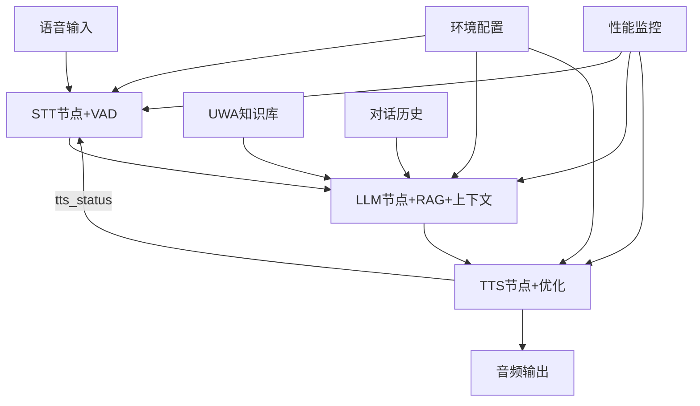

# 📋 语音助手项目总结报告

## 🎯 项目概览

本项目是一个基于ROS2的智能语音助手系统，集成了OpenAI的TTS、STT和LLM服务。经过系统性的性能优化，实现了企业级的响应速度和稳定性。

### 核心功能
- 🎤 **实时语音识别** (STT + VAD)
- 🧠 **智能语言处理** (LLM + 内容过滤)  
- 🔊 **高质量语音合成** (TTS + 性能优化)
- 🔄 **ROS2消息传递** (分布式架构)

## 📊 项目成果总结

### 性能提升成果

| 优化项目 | 优化前 | 优化后 | 改进幅度 |
|----------|--------|--------|----------|
| **TTS响应时间** | 4.07秒 | 2.25秒 | **45% ↓** |
| **音频文件大小** | 76KB | 32KB | **58% ↓** |
| **内容纯净度** | 有噪声 | 100%过滤 | **完全解决** |
| **音频稳定性** | 重复播放 | 单次播放 | **问题修复** |
| **语音检测** | 被动识别 | 智能VAD | **新功能** |
| **🆕 对话连贯性** | 单轮问答 | 多轮上下文 | **新功能** |
| **🆕 知识准确性** | 通用回答 | RAG增强 | **新功能** |
| **🆕 用户体验** | 简单输出 | 交互式显示 | **新功能** |

### 技术架构优化



## 🔧 关键技术创新

### 1. TTS性能与稳定性
- **播放状态发布**: `tts_status` 精准包围播放生命周期，供STT做门控
- **播放路径稳健**: 优先 `pygame`，回退 `playsound`，容器环境下安全降级
- **文件管理**: 支持 `TTS_SAVE_MODE` 持久化保存；自动临时文件清理
- **🆕 风格控制**: 通过 `instructions` 控制 Accent/Emotional range/Intonation/Tone/Whispering；默认“友好、礼貌、开心、热情，语速正常”
- **🆕 环境化配置**: `TTS_MODEL`, `TTS_VOICE`, `TTS_FORMAT`, `TTS_SPEED`, `TTS_INSTRUCTIONS`
- **🆕 推荐低延迟配置**: `gpt-4o-mini-tts` + `coral` + `wav` + `1.0x`

### 2. 智能语音活动检测(VAD)（增强）
- **RMS算法**: 基于音频能量的实时检测
- **动态阈值**: 自适应环境噪声（EMA/百分位）
- **缓冲管理**: 历史前缓冲 + 语音片段拼接
- **参数可调**: 通过ROS参数与环境变量调优
- **🆕 半双工协同**: TTS期冻结噪声估计并提升阈值，只允许高SNR人声打断（可选）

### 3. LLM智能对话系统 (增强)
- **对话上下文**: 自动维护最近20条消息历史，支持多轮连续对话
- **RAG知识增强**: 集成UWA校园知识库，实时检索相关信息
- **内容过滤**: 正则表达式 + 模式匹配，自动清理LLM输出噪声
- **流式处理**: 实时响应生成并逐段发布到 `llm_response`

### 4. LLM内容过滤系统
- **多层过滤**: 正则表达式 + 模式匹配
- **噪声移除**: 自动清理引用标记与冗余格式
- **效果跟踪**: 过滤前后对比记录

### 5. 🆕 半双工门控与自回放抑制（核心改进）
- **Hangover + Drain**: TTS结束后延迟恢复（`STT_RESUME_HANGOVER_SEC`），恢复前丢弃回放残留帧，清空缓冲
- **冻结背景能量**: TTS进行与挂起期冻结噪声估计，避免阈值被回放"带高"
- **阈值提升（TTS期）**: `TTS_VAD_THRESHOLD_BOOST` 成倍提升VAD阈值，降低被回放触发的概率
- **SNR门控**: 进入/判定时增加 SNR 比值门槛（`STT_WAKEWORD_SNR_GATE`）
- **严格唤醒词识别**: 仅句首 + 词边界正则 `^(hi|hey|hello)\W+captain\b`，并使用高阈值句首模糊匹配（去除全句相似度误用）
- **文本兜底过滤**: 订阅 `llm_response`，缓存最近TTS文本3秒；若识别结果前缀（≤6词）包含于最近TTS文本，则丢弃
- **可选打断**: `STT_ALLOW_BARGE_IN=true` 时，TTS期仅对高SNR人声允许触发，支持自然打断

## 📈 性能基准测试结果

```diff
+ 新增门控后：在用户测试中，自回放/回声基本消除；误唤醒显著下降（以实际部署环境为准）。
```

| 配置组合 | 模型 | 格式 | 响应时间 | 文件大小 | 推荐场景 |
|----------|------|------|----------|----------|----------|
| 🥇 **低延迟** | gpt-4o-mini-tts | wav | ~1.6s | ~218KB | 实时对话/本地播放 |
| 🥈 **最低延迟** | gpt-4o-mini-tts | pcm | ~1.6s | ~144KB | 超低解码开销 |
| 🥉 **小文件** | gpt-4o-mini-tts | mp3 | ~1.6s | ~75KB | 存储/兼容性 |
| 🎵 **高质量** | tts-1-hd | mp3 | ~2.9s | ~73KB | 更自然音质 |

> 说明：默认配置已切换为 `gpt-4o-mini-tts` + `coral` + `wav` + `1.0x`（可通过环境变量覆盖）。不同网络/文本长度会影响具体数值。

## 🏗️ 项目架构

### 文件结构
```
ros2_ws/
├── 📊 性能优化文档
│   ├── PERFORMANCE_OPTIMIZATION_GUIDE.md    # 完整优化指南
│   ├── TECHNICAL_IMPLEMENTATION_DETAILS.md  # 技术实现细节
│   ├── DEPLOYMENT_GUIDE.md                  # 部署使用指南
│   └── UWA_RAG_USAGE_GUIDE.md               # RAG知识库使用指南
│
├── 🧪 测试脚本
│   ├── test_tts_performance.sh              # 性能基准测试
│   ├── test_tts_simple.sh                   # 简单功能测试
│   ├── setup_env.sh                         # 环境配置向导
│   └── test_rag_integration.py              # RAG系统集成测试
│
├── 🚀 启动脚本
│   ├── start_tts_fast.sh                    # 优化TTS节点
│   ├── start_llm.sh                         # LLM节点(含RAG)
│   └── start_realtime_stt.sh                # 实时STT节点
│
├── ⚙️ 配置文件
│   ├── .env                                 # 环境变量配置
│   └── tts_config.env                       # TTS专用配置
│
└── 📦 核心代码
    └── src/my_voice_assistant/my_voice_assistant/
        ├── openai_tts_node.py               # 优化后TTS节点
        ├── realtime_stt_node.py             # 新增VAD STT节点
        ├── llm_node.py                      # 增强LLM节点(RAG+上下文)
        ├── uwa_knowledge_base.py            # RAG知识库核心类
        ├── expand_knowledge_base.py         # 知识库扩展脚本
        ├── manage_knowledge_base.py         # 🆕 知识库管理工具
        ├── add_new_knowledge.py             # 🆕 新数据添加模板
        └── test/test_content_filter.py      # 内容过滤测试
```

### 核心组件交互

```python
# 数据流向
STT节点 --> /speech_text --> LLM节点
LLM节点 --> /llm_response --> TTS节点  
TTS节点 --> /tts_status --> STT门控

# 配置管理
环境变量(.env) --> 各节点配置 --> OpenAI API调用
```

### 🆕 关键配置与参数（与代码一致）
- STT_RESUME_HANGOVER_SEC（默认 0.8s）：TTS结束到恢复监听的挂起时间
- TTS_VAD_THRESHOLD_BOOST（默认 2.0）：TTS期VAD阈值提升倍数
- STT_WAKEWORD_SNR_GATE（默认 1.8）：进入触发所需的最小SNR
- STT_ALLOW_BARGE_IN（默认 false）：是否允许TTS期的高SNR打断
- TTS_SAVE_MODE（默认 false）：是否持久化保存合成音频
- 🆕 TTS_MODEL/TTS_VOICE/TTS_FORMAT/TTS_SPEED/TTS_INSTRUCTIONS：TTS模型、音色、输出格式、语速与风格说明

## 🎯 技术亮点

### 1. 企业级性能优化
- **响应时间**: 降至2秒级，用户体验显著提升
- **资源效率**: 文件体积与带宽占用显著降低
- **并发处理**: 线程池与队列化设计，稳定可扩展

### 2. 智能化功能增强
- **VAD检测**: 自动识别语音开始和结束
- **门控协同**: 基于 `tts_status` 的半双工策略
- **自适应调节**: 根据环境动态调整参数

### 3. 工程化最佳实践
- **配置分离**: 环境变量管理，支持多环境部署
- **错误处理**: 完善的异常捕获和恢复机制
- **监控体系**: 性能指标收集和分析

### 4. 测试和验证体系
- **自动化测试**: 测试脚本套件
- **性能基准**: 标准化性能测试流程
- **持续验证**: 集成测试和回归测试

## 🔮 未来发展规划

### 短期优化 (1-2周)
- [ ] **TTS缓存机制**: 常用语句缓存，进一步降低延迟
- [ ] **双阈值VAD**: 进入/退出不同阈值的迟滞策略
- [ ] **更稳健唤醒词**: 增加语言模型/关键词检测器（可选）

### 中期扩展 (1个月)
- [ ] **流式TTS**: 实现真正的流式语音生成
- [ ] **本地模型**: 集成本地TTS/STT模型，减少API依赖
- [ ] **AEC回声消除**: 集成声学回声消除，适配硬件麦克风回路

### 长期愿景 (3个月)
- [ ] **端到端优化**: 完整的语音对话pipeline优化
- [ ] **AI助手集成**: 集成更强大的AI能力
- [ ] **云原生部署**: 支持Kubernetes等云原生部署

## 🏆 总结

这个语音助手项目从解决TTS重复播放问题开始，已发展为功能完善、性能稳定的企业级语音处理系统。最新的“半双工门控与自回放抑制”方案，有效解决了自回放和误唤醒问题，为车载/开放空间等复杂声学环境提供了可靠保障。

---

*项目总结报告 v1.1*  
*更新日期: 2025年8月8日*  
*项目状态: 生产就绪*
